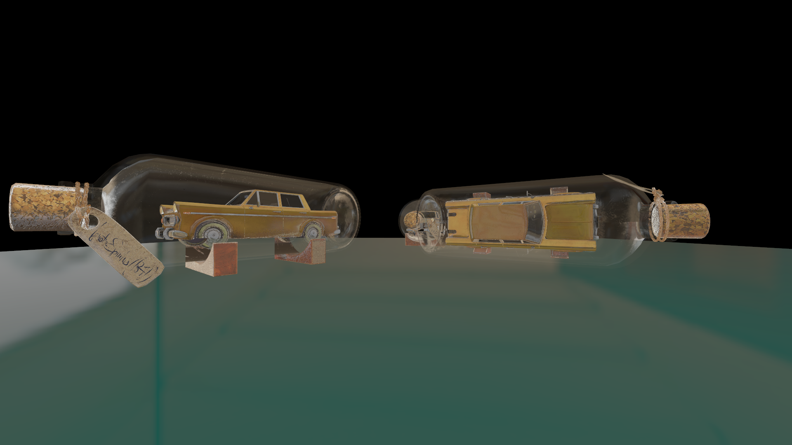

# Ira

[](https://github.com/matteopolak/ira/actions)

A general-purpose, code-first game engine.

## Features

- PBR rendering and lighting with [`wgpu`](https://github.com/gfx-rs/wgpu) for graphics
- Simple packaging system for game assets with [`ira_drum`](./ira_drum)
  - glTF 2.0 support
  - OBJ support
- Physics with [`rapier`](https://github.com/dimforge/rapier)
- Built-in multiplayer support with custom packet support
- Headless server, client, and server-client support

## Examples

```rust
struct App {
  car: InstanceRef,
}

impl ira::App for App {
  fn on_init(_window: &mut Window) -> Drum {
    Drum::from_path("car.drum").unwrap()
  }

  fn on_ready(ctx: &mut Context) -> Self {
    Self {
      car: ctx.add_instance(0, Instance::builder().up(Vec3::Z))
    }
  }

  fn on_update(&mut self, ctx: &mut Context, delta: Duration) {
    self.car.update(ctx, |i, p| i.rotate_y(p, delta.as_secs_f32() * PI * 0.25));
  }
}

fn main() -> Result<(), EventLoopError> {
  Game::<App>::default().run()
}
```

More examples can be found in the [`examples`](examples) directory.

## Preparing assets

The `ira` tool can be used to pack various game assets (glTF, etc.) into a single Drum.

See the [ira_cli](ira_cli/README.md) documentation for more information.

## Screenshots



## License

Licensed under the MIT license.

